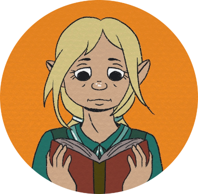

All character graphics depicted in this episode were illustrated by [Olive Firbolg](https://olivefirbolg.com).

## The Dock Ward *(continued)*

- Just as the party showed up to the Zhentarim hideout, Judy got a call, a final responder from his Kraigsledger post. She had been texting him as the party walked to various locations in the Dock Ward, and he'd been updating her on their location.

#### Isabella

Isabella is a 75 year-old rock gnome librarian; or at least, until recently. The owner of the library, a crotchety old man, just croaked and left instructions in his will to liquidate the entire library, leaving Isabella without a job. Honestly, this is all for the best; Isabella has spent years of her life pouring over books about magic and though she's admittedly a bit nervous about it, is excited to begin her new career as an adventurer.
